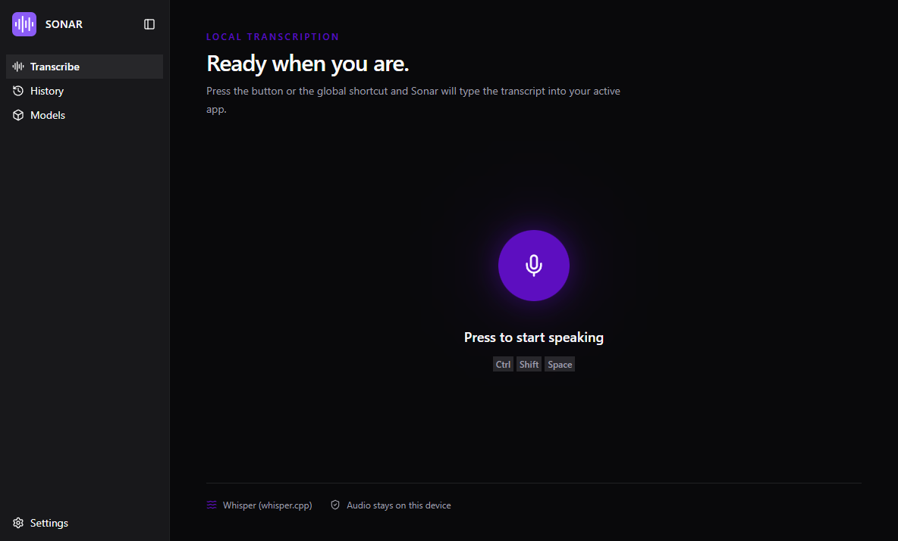
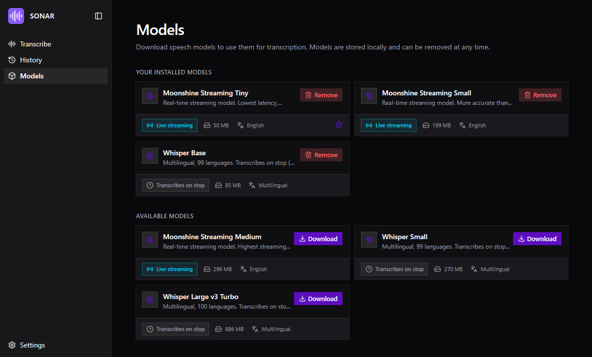
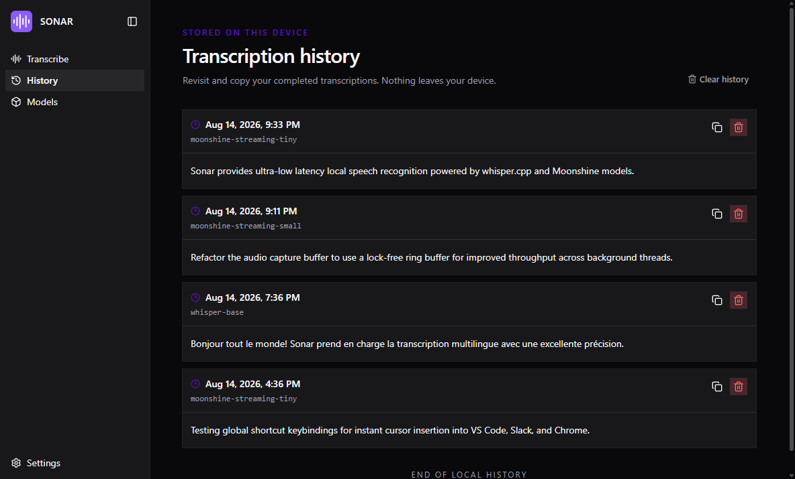
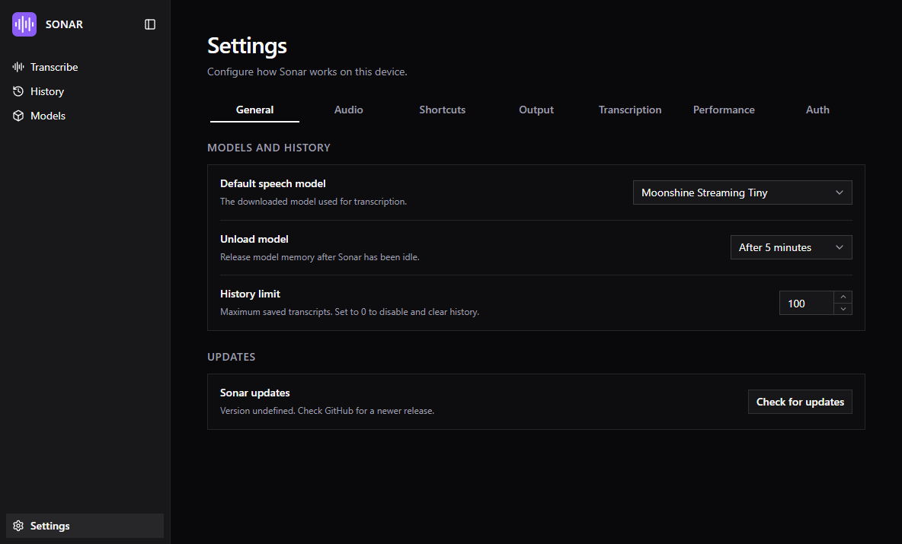
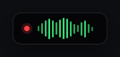
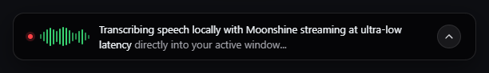
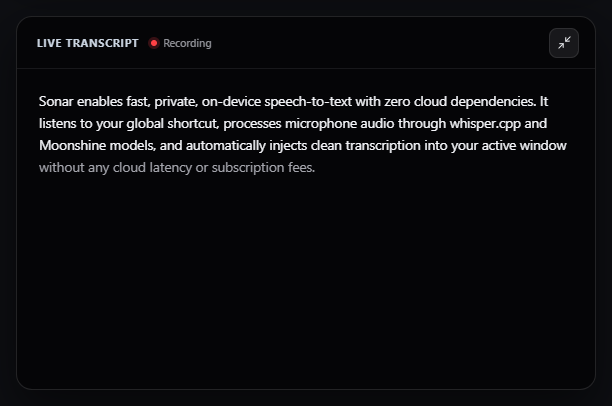

# Sonar

<p align="center">
  
</p>

<p align="center">
  <strong>Fast, private, local-first desktop speech-to-text.</strong><br />
  Press a global shortcut, speak naturally, and watch your words typed directly into any active application.
</p>

<p align="center">
  <a href="#features">Features</a> •
  <a href="#screenshots">Screenshots</a> •
  <a href="#architecture">Architecture</a> •
  <a href="#getting-started">Getting Started</a> •
  <a href="#supported-models">Supported Models</a> •
  <a href="#shortcuts">Shortcuts</a> •
  <a href="#license">License</a>
</p>

---

## Overview

**Sonar** is a cross-platform desktop dictation tool designed with privacy and speed at its core. Unlike cloud-based speech-to-text tools, Sonar processes all audio and runs AI inference entirely on your local machine using Rust, `whisper.cpp`, and Moonshine models. 

Your voice never leaves your device, and you get instant, low-latency transcription anywhere—in your code editor, browser, terminal, email client, or chat apps.

---

## Screenshots

### 🎙️ Live Dictation & Real-Time Ready
The clean, minimal desktop interface gives you full control and status of your local transcription engine.

<p align="center">
  
</p>

---

### 📦 Speech Models Hub
Download, switch, and manage local GGUF speech models with a single click. Choose between real-time streaming Moonshine models or high-accuracy multilingual Whisper models.

<p align="center">
  
</p>

---

### 🕒 Searchable Local History
Every transcription is saved to a local, private SQLite database. Search, copy to clipboard, or delete entries at any time.

<p align="center">
  
</p>

---

### ⚙️ Powerful Customization & Settings
Customize recognition thresholds, add custom vocabulary (names, technical jargon), configure automatic filler-word removal, and choose hardware acceleration backends.

<p align="center">
  
</p>

---

### 🌊 Real-Time Floating Dock Overlay
Sonar features an adaptive floating dock that appears at the bottom of your screen during recording. It supports three distinct presentation sizes:

#### 1. Compact Resting Pill (Minimal)
Minimalist indicator showing active recording status and live equalizer waveform bars.
<p align="center">
  
</p>

#### 2. Hover Peek Bar (Medium Inline Preview)
Hovering over the dock smoothly expands it to display real-time live transcript streaming text alongside the waveform and expand controls.
<p align="center">
  
</p>

#### 3. Expanded Live Transcript Panel (Full)
Clicking expand opens a multi-line scrolling transcript view with tentative token streaming, recording status, and collapse button.
<p align="center">
  
</p>

---

## Features

- **100% Local & Private:** All speech recognition runs on-device. No subscriptions, no cloud APIs, no data collection.
- **Global Hotkey:** Press <kbd>Ctrl</kbd> + <kbd>Shift</kbd> + <kbd>Space</kbd> (or <kbd>Cmd</kbd> + <kbd>Shift</kbd> + <kbd>Space</kbd> on macOS) from any app to dictate. Sonar pastes or types the transcript straight into your active window.
- **Real-Time Streaming Dictation:** Powered by Moonshine streaming models for instant, word-by-word transcription as you talk.
- **Multilingual Support:** Supports 99+ languages via Whisper models (Base, Small, Large v3 Turbo).
- **GPU & Hardware Acceleration:** Accelerated via Vulkan GPU compute or highly optimized CPU instruction sets (AVX2, AVX512, NEON, SSE4.2).
- **Custom Vocabulary:** Add domain-specific terms, acronyms, and names with configurable fuzzy word correction.
- **Automatic Filler Word Removal:** Cleans up speech by removing non-lexical fillers ("um", "uh", "like") automatically.
- **Smart Formatting:** Automatic capitalization, punctuation correction, and optional trailing space insertion.
- **Auto-Submit Mode:** Automatically trigger <kbd>Enter</kbd> or <kbd>Ctrl</kbd> + <kbd>Enter</kbd> upon stopping dictation (ideal for chat apps and AI prompts).
- **Memory Efficient:** Configurable model unload timeout to automatically free system RAM/VRAM when idle.

---

## Supported Models

| Model | Type | Languages | Size | Best For |
| :--- | :--- | :--- | :--- | :--- |
| **Moonshine Streaming Tiny** *(Default)* | Real-Time Streaming | English (`en`) | ~50 MB | Lowest latency, real-time live typing |
| **Moonshine Streaming Small** | Real-Time Streaming | English (`en`) | ~198 MB | Higher accuracy streaming |
| **Moonshine Streaming Medium** | Real-Time Streaming | English (`en`) | ~295 MB | Maximum accuracy streaming |
| **Whisper Base** | Batch (on stop) | Multilingual (99) | ~85 MB | Fast multilingual dictation |
| **Whisper Small** | Batch (on stop) | Multilingual (99) | ~270 MB | Balanced multilingual accuracy |
| **Whisper Large v3 Turbo** | Batch (on stop) | Multilingual (100) | ~886 MB | Best multilingual accuracy and accents |

---

## Architecture

Sonar is architected as an Electron desktop shell connected directly to a high-performance modular Rust core via **napi-rs** native bindings (zero network overhead, no sidecar process).

```
┌─────────────────────────────────────────────────────────────┐
│                      ELECTRON DESKTOP                       │
│  React 19 • TypeScript • Tailwind CSS • TanStack Router     │
│  Main Process ── (IPC Bridge / Preload) ── Renderer UI     │
└──────────────────────────────┬──────────────────────────────┘
                               │ N-API (Native Addon)
┌──────────────────────────────▼──────────────────────────────┐
│                       RUST CORE CRATES                      │
│                                                             │
│  ├── sonar-core          N-API bindings & orchestration     │
│  ├── sonar-transcription whisper.cpp & Moonshine inference  │
│  ├── sonar-audio         Low-latency CPAL capture & meters  │
│  ├── sonar-dictation     Punctuation, fillers & formatters  │
│  ├── sonar-input         OS-level cursor & keyboard typing  │
│  └── sonar-models        Model catalog & HuggingFace fetch  │
└─────────────────────────────────────────────────────────────┘
```

---

## Getting Started

### Prerequisites

- **Node.js**: `v22.x` or later
- **Rust**: `1.80+` stable toolchain (`rustup`)
- **C/C++ Build Tools**:
  - **Windows**: Visual Studio C++ Build Tools & CMake
  - **macOS**: Xcode Command Line Tools (`xcode-select --install`)
  - **Linux**: `build-essential`, `cmake`, `libasound2-dev`
- *(Optional)* **Vulkan SDK**: For GPU-accelerated inference.

### Clone & Install

```bash
# Clone the repository
git clone https://github.com/maharshi365/sonar.git
cd sonar

# Install dependencies
npm install
```

### Development

```bash
# Build the native Rust core in debug mode and start Vite dev server
npm run dev
```

### Building for Production

```bash
# Build the native addon and compile renderer/main bundles
npm run build

# Package the application into standalone installers (NSIS / DMG / AppImage)
npm run package
```

---

## Shortcuts & Controls

| Shortcut (Windows / Linux) | Shortcut (macOS) | Action |
| :--- | :--- | :--- |
| <kbd>Ctrl</kbd> + <kbd>Shift</kbd> + <kbd>Space</kbd> | <kbd>Cmd</kbd> + <kbd>Shift</kbd> + <kbd>Space</kbd> | **Toggle Dictation** (Start / Stop & Insert) |
| <kbd>Ctrl</kbd> + <kbd>Shift</kbd> + <kbd>Backspace</kbd> | <kbd>Cmd</kbd> + <kbd>Shift</kbd> + <kbd>Backspace</kbd> | **Cancel Dictation** (Discard recording) |

*Shortcuts can be customized in the **Settings → Shortcuts** menu.*

---

## Configuration & Settings

- **Output Method**: Choose between direct cursor pasting, keyboard typing simulation, or copying to the system clipboard.
- **Audio Input**: Select specific input microphones or use system defaults.
- **Recognition & Vocabulary**: Add custom words to guide the decoder on industry-specific words and proper nouns.
- **Inference Hardware**: Select `Auto`, `GPU (Vulkan)`, or `CPU` compute backends.
- **Auto-Submit**: Optionally send an `Enter` keystroke after transcription for prompt bars and chat interfaces.

---

## Tech Stack

- **Desktop Framework:** [Electron](https://www.electronjs.org/)
- **Native Core:** [Rust](https://www.rust-lang.org/) + [napi-rs](https://napi.rs/)
- **Speech Engines:** [whisper.cpp](https://github.com/ggerganov/whisper.cpp) & [Moonshine](https://github.com/usefulsensors/moonshine)
- **Frontend:** [React 19](https://react.dev/), [TypeScript](https://www.typescriptlang.org/), [Tailwind CSS v4](https://tailwindcss.com/)
- **Routing & State:** [TanStack Router](https://tanstack.com/router), [TanStack Query](https://tanstack.com/query)
- **UI Components:** [Base UI](https://base-ui.com/), [Lucide Icons](https://lucide.dev/)

---

## License

This project is licensed under the [MIT License](LICENSE).
