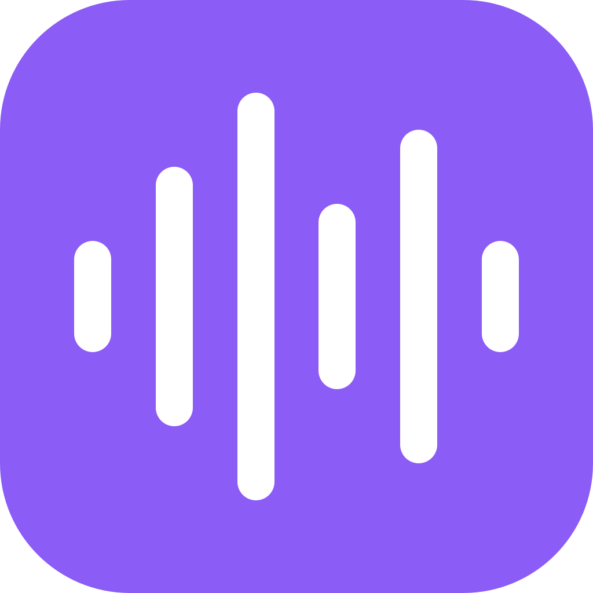

# Sonar

<p align="center">
  
</p>

Sonar is a native, local-first desktop dictation application. Press a global shortcut, speak, and Sonar transcribes locally before inserting the result into the active application.

## Features

- Native GPU-accelerated desktop interface built with [GPUI](https://gpui.rs/).
- Local Whisper and Moonshine inference with no cloud transcription.
- Global start/stop and cancel shortcuts.
- Live audio meter and floating transcript overlay.
- Resumable local model downloads and model hot-swapping.
- Compatible settings and SQLite history from Sonar 0.1.x.
- Configurable microphone, output delivery, cleanup, retention, and acceleration.

## Architecture

```text
sonar-app (GPUI application)
  |-- settings, history, shortcuts, windows, and application state
  |-- sonar-dictation       recording session orchestration
  |-- sonar-audio           CPAL capture and audio meters
  |-- sonar-transcription   Whisper/Moonshine inference
  |-- sonar-models          model catalog and downloads
  `-- sonar-input           native cross-application text insertion
```

There is no browser runtime, Node.js process, IPC bridge, native addon, or sidecar. One Rust process owns the interface and speech pipeline.

## Development

The repository pins Rust 1.97.1 and GPUI to a known Zed revision because GPUI is pre-1.0.

### Prerequisites

- Rust via [rustup](https://rustup.rs/).
- Windows: Visual Studio C++ Build Tools, CMake, and optionally the Vulkan SDK.
- macOS: Xcode Command Line Tools.
- Linux: a C/C++ toolchain, CMake, `libasound2-dev`, Vulkan development files, and GPUI's Wayland/X11 dependencies.

Run the application:

```bash
cargo run --manifest-path src/crates/Cargo.toml -p sonar-app
```

Build a release binary:

```bash
cargo build --manifest-path src/crates/Cargo.toml -p sonar-app --release
```

The executable is `src/crates/target/release/sonar` (`sonar.exe` on Windows). Shared inference libraries are staged beside it automatically.

## Verification

```bash
cargo fmt --manifest-path src/crates/Cargo.toml --all -- --check
cargo test --manifest-path src/crates/Cargo.toml --workspace
cargo clippy --manifest-path src/crates/Cargo.toml --workspace --all-targets
```

## Data

Sonar keeps all user data locally in the OS application configuration directory under `Sonar`:

- `settings.json`
- `history.db`
- `models/`

## Default Shortcuts

| Action | Windows/Linux | macOS |
| --- | --- | --- |
| Toggle dictation | `Ctrl+Shift+Space` | `Cmd+Shift+Space` |
| Cancel dictation | `Ctrl+Shift+Backspace` | `Cmd+Shift+Backspace` |

## License

[MIT](LICENSE)
